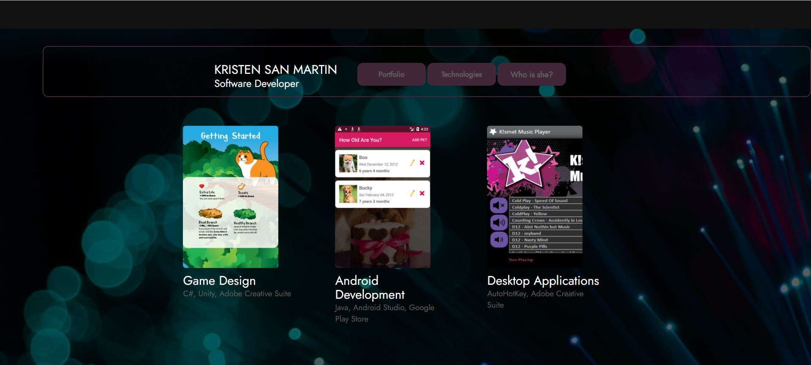
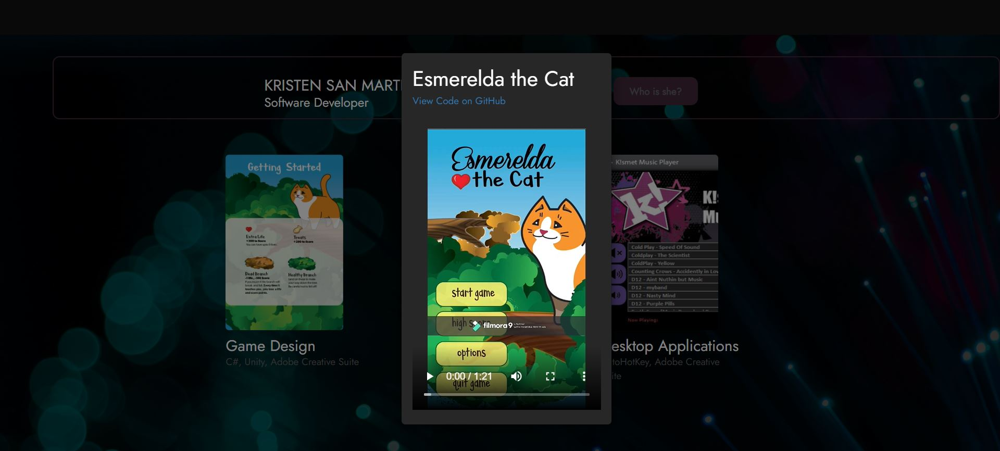

# My First Portfolio


## Description
This project was created when I only had two weeks of experience in web development. I completed this much with a weeks worth of time using a newly acquired understanding of **HTML 5**, **CSS 3** , and **JQuery**.
## Technologies
**JQuery** was used to generate animations for the UX, **HTML 5** was the scaffodling, **CSS 3** was used to design the user interface and **Bootstrap** was used for the modals.


## Screenshots





## Installation

1. Clone the repository down to your local drive by opening up a terminal in the folder of your choice and type the code: 
```bash
git clone https://github.com/KISMET-INC/webfun.git
```
2. Double click the **index.html** to launch the website locally


## Support
Any questions or comments about this repository and it's contents can be emailed to kmoreland909@gmail.com.

## Roadmap
In the future, I may expand this project and my it my working portfolio, but there is no set timeline for this at this point.

## Contributing
I am not accepting contributions to this project at this time.

## Authors and acknowledgment
Thank you to the amazing staff and instructors at **[Coding Dojo](https://www.codingdojo.com/onsite-boot-camp#dates-and-tuition)** for teaching me the skills and technologies needed for me to complete this project.